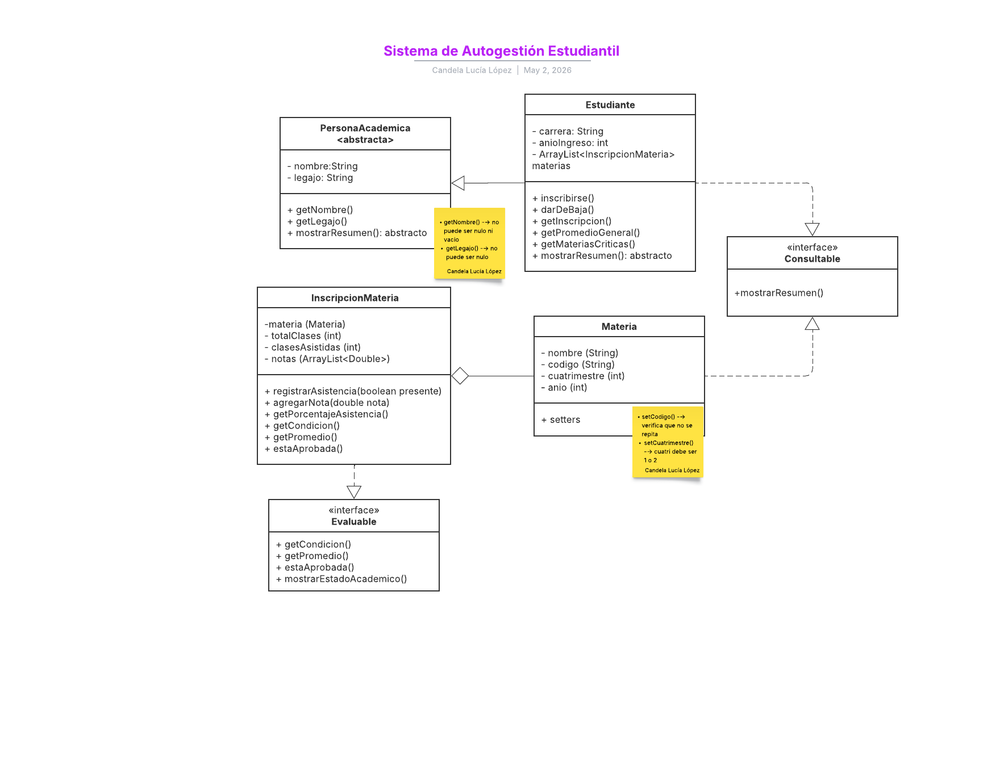

# IES-Interfaz-Grafica

# SISTEMA DE AUTOGESTIÓN ESTUDIANTIL 

# Objetivo
Desarrollar en Java una aplicación de consola que simule un sistema de autogestión estudiantil. El  sistema permitirá a un estudiante registrar sus materias, gestionar sus asistencias y calificaciones,  conocer su condición académica (regular o libre) y obtener reportes de su situación académica  general. 
Este proyecto aplica en forma integrada todos los temas del primer bloque de la materia: tipos de  datos, estructuras de control, arrays, colecciones, métodos, clases, herencia, polimorfismo, encapsulamiento e interfaces. 

# Diagrama de clases

Link: [https://lucid.app/lucidchart/b2eaeac0-28cc-4897-8455-b2c72d7da56f/edit?viewport_loc=478%2C729%2C1239%2C421%2CHWEp-vi-RSFO&invitationId=inv_5bcdf521-160c-4ffb-a895-0b0a3c404661]

## 🤖 Uso de IA
Se utilizó IA como apoyo para:
- Resolución de errores
- Optimización de código

Links a conversaciones de Cande:
- [https://chat.openai.com/yyyy](https://chatgpt.com/share/69f4d80a-b204-83e9-b50a-10b42722ca33)]
- [https://claude.ai/share/97197b90-684a-41ae-a43d-f6a00381f829]

  
